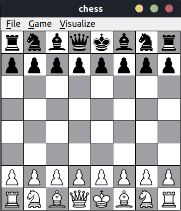

<!-- PROJECT LOGO -->
<br />
<div align="center">
  <a href="https://github.com/github_username/chess">
    
  </a>

<h3 align="center">chess</h3>

  <p align="center">
    An implementation of the chess boardgame in c++. 
    <br />
    <a href="https://github.com/AchrafYndz/chess">View Demo</a>
    ·
    <a href="https://github.com/AchrafYndz/chess/issues">Report Bug</a>
    ·
    <a href="https://github.com/AchrafYndz/chess/issues">Request Feature</a>
  </p>
</div>


<!-- TABLE OF CONTENTS -->
<details>
  <summary>Table of Contents</summary>
  <ol>
    <li>
      <a href="#about-the-project">About The Project</a>
      <ul>
        <li><a href="#built-with">Built With</a></li>
      </ul>
    </li>
    <li>
      <a href="#getting-started">Getting Started</a>
      <ul>
        <li><a href="#prerequisite">Prerequisite</a></li>
        <li><a href="#installation">Installation</a></li>
      </ul>
    </li>
    <li><a href="#features">Features</a></li>
    <li><a href="#contributing">Contributing</a></li>
    <li><a href="#acknowledgments">Acknowledgments</a></li>
  </ol>
</details>


<!-- ABOUT THE PROJECT -->

## About The Project

<p align="center">
  
</p>

This was made as a project for the course "Introduction to Programming" at the University of Antwerp. This was my first
big project in `c++`.

<p align="right">(<a href="#top">back to top</a>)</p>

### Built With

* [![CPP][cpp.com]][cpp-url]
* [![QT][qt.io]][qt-url]

<p align="right">(<a href="#top">back to top</a>)</p>

<!-- GETTING STARTED -->

## Getting Started

This is an example of how you may give instructions on setting up your project locally.
To get a local copy up and running follow these simple example steps.

### Prerequisite

#### QT 5.15.2

The following installation instructions are for Linux. I refer other operating systems to QT's websites, to follow the
instructions on there.

###### Linux 

* Go to https://www.qt.io/download, select "open source".
* Find the "Looking for QT binaries?" window and select "Download
  the QT Online Installer".
* In your terminal, navigate to your download folder:

```bash
cd Downloads
```

* Make the installer executable:

```bash
chmod +x qt-unified-linux-x64-?.?.?-online.run
```

* Run the installer:

```bash
sudo ./qt-opensource-linux-x64-?.?.?.run
```

* Make an account if you don't have one already, read the license agreement and choose your privacy preference.

* Choose the directory where you'd like to install `QT` and **note** this directory, as you will need it in the
  `CMakeLists.txt`. Choose `Custom Installation`.

* Under QT, select QT 5.15.2, desktop gcc 64-bit. Make sure `CMake` is checked, under "Developer and Designer Tools"

* Accept the agreements and install.

### Installation

1. Clone the repo
   ```sh
   git clone git@github.com:AchrafYndz/chess.git
   ```
2. Open the CMakeLists.txt file and uncomment the lines for your Operating System. Make sure you change the directory to
   the one where you installed QT.

<p align="right">(<a href="#top">back to top</a>)</p>


<!-- FEATURES -->

## Features

- [X] Game rules
    - [X] Check & checkmate
    - [X] Promotion
    - [X] Stalemate
    - [X] Castling
    - [X] En Passant
- [X] Help
    - [X] Mark selected tile
    - [X] Mark valid moves for selected piece
    - [X] Mark all threatened tiles where selected piece could be captured
    - [X] Mark all enemy pieces that can be captured with selected piece
- [ ] Menu
    - [X] Enable/disable help features\
    - [ ] Save/load game
    - [ ] Undo/redo move
- [ ] Other
    - [ ] Enemy bot

See the [open issues](https://github.com/AchrafYndz/chess/issues) for a full list of proposed features (and known
issues).

<p align="right">(<a href="#top">back to top</a>)</p>


<!-- CONTRIBUTING -->

## Contributing

Contributions are what make the open source community such an amazing place to learn, inspire, and create. Any
contributions you make are **greatly appreciated**.

If you have a suggestion that would make this better, please fork the repo and create a pull request. You can also
simply open an issue with the tag "enhancement".
Don't forget to give the project a star! Thanks again!

1. Fork the Project
2. Create your Feature Branch (`git checkout -b feature/AmazingFeature`)
3. Commit your Changes (`git commit -m 'Add some AmazingFeature'`)
4. Push to the Branch (`git push origin feature/AmazingFeature`)
5. Open a Pull Request

<p align="right">(<a href="#top">back to top</a>)</p>


<!-- ACKNOWLEDGMENTS -->

## Acknowledgments

* My professor [Toon Calders](https://github.com/tcalders) and assistants [Tom Hofkens](https://github.com/thofkens) and [Daphne Lenders]()

<p align="right">(<a href="#top">back to top</a>)</p>


<!-- MARKDOWN LINKS & IMAGES -->

[cpp-url]: https://cplusplus.com

[cpp.com]: https://img.shields.io/badge/c%2B%2B-0769AD?style=for-the-badge&logo=c%2B%2B&logoColor=white

[qt-url]: https://www.qt.io

[qt.io]: https://img.shields.io/badge/Qt-%23217346.svg?style=for-the-badge&logo=Qt&logoColor=white